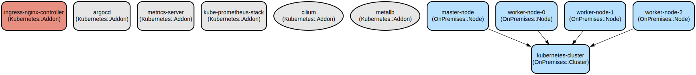

Inspired by Kubernetes studies and the lack of a homeLab, I decided to share the skeleton of my "Playground"

# Kubernetes Easy Mode: Automated Kubernetes Cluster Deployment with Vagrant

A Go-based automation tool that simplifies the deployment and management of multi-node Kubernetes clusters using Vagrant. It provides a streamlined way to create, manage, and monitor development Kubernetes environments with integrated monitoring and GitOps capabilities.

This project automates the setup of a complete Kubernetes environment including a master node and multiple worker nodes, with pre-configured essential components like Cilium for networking, MetalLB for load balancing, NGINX Ingress Controller, ArgoCD for GitOps, and Prometheus for monitoring. The automation now uses Helm charts with standard templates for easier management and updates, handling all aspects from VM provisioning to Kubernetes component installation and configuration, making it ideal for development and testing environments.

## Repository Structure
```
.
├── devfile.yaml              # Development environment configuration
├── main.go                   # Application entry point
├── pkg/                      # Core application packages
│   ├── cluster/             # Cluster management implementation
│   ├── config/              # Configuration handling
│   └── ui/                  # User interface components
├── scripts/                  # Automation scripts
│   ├── k8s-install.sh       # Kubernetes installation script
│   ├── up-k8s.sh           # Cluster initialization script
│   ├── helm-install.sh     # Helm-based component installation
│   ├── helm/                # Helm values and configurations
│   │   ├── argocd/         # ArgoCD Helm values
│   │   ├── ingress-nginx/  # NGINX Ingress Helm values
│   │   ├── metallb/        # MetalLB Helm values
│   │   ├── prometheus/     # Prometheus Stack Helm values
│   │   ├── metrics-server/ # Metrics Server Helm values
│   │   └── local-path-provisioner/ # Storage provisioner values
│   └── sys-moni.sh         # System monitoring script
└── Vagrantfile              # Vagrant VM configuration
```

## Usage Instructions
### Prerequisites
- VirtualBox 6.1 or later
- Vagrant 2.2.x or later
- Go 1.19 or later
- At least 8GB of RAM available
- 20GB of free disk space
- Linux/Unix-based operating system (MacOS or Linux recommended)

### Installation

1. Clone the repository:
```bash
git clone <repository-url>
cd kubernetes-easy-mode
```

2. Install dependencies:
```bash
go mod download
```

3. Build the application:
```bash
go build -o k8s-easy
```

### Quick Start

1. Start the application:
```bash
./k8s-easy
```

2. From the menu, select option 1 to start the cluster:
```
1. Start Cluster
2. Show Status
3. Destroy Cluster
4. Exit
```

3. Wait for the cluster initialization to complete (approximately 10-15 minutes)

### More Detailed Examples

1. Monitor cluster nodes:
```bash
./scripts/monitor-node.sh
```

2. Check cluster status:
```bash
./scripts/status-k8s.sh
```

3. Install components individually via Helm:
```bash
# Install specific components
./scripts/helm-install.sh metallb
./scripts/helm-install.sh ingress
./scripts/helm-install.sh argocd
./scripts/helm-install.sh prometheus

# Install all components at once
./scripts/helm-install.sh all
```

4. Access ArgoCD UI:
```bash
# Get the ArgoCD admin password
kubectl -n argocd get secret argocd-initial-admin-secret -o jsonpath="{.data.password}" | base64 -d
# Access via https://argocd.high.sh
```

5. Access Grafana UI:
```bash
# Default credentials: admin/admin123
# Access via port-forward or create ingress
kubectl port-forward -n monitoring svc/kube-prometheus-stack-grafana 3000:80
```

### Troubleshooting

1. VM Creation Issues
- Error: "VT-x is not available"
  * Enable virtualization in BIOS settings
  * Ensure no other virtualization software is running

2. Kubernetes Installation Failures
- Check logs:
```bash
vagrant ssh master-1
sudo journalctl -u kubelet
```
- Verify network connectivity:
```bash
kubectl get nodes
kubectl get pods --all-namespaces
```

3. MetalLB Configuration
- Verify IP pool configuration:
```bash
kubectl get ipaddresspool -n metallb-system
```
- Check MetalLB pods:
```bash
kubectl get pods -n metallb-system
```

## Data Flow
The system automates the creation and configuration of a Kubernetes cluster through a series of coordinated steps, from VM provisioning to service deployment.

```ascii
[User Input] -> [Cluster Manager] -> [Vagrant VMs] -> [Kubernetes Setup]
                      |                                      |
                      v                                      v
              [System Monitoring] <- [MetalLB/Ingress] <- [Services]
```

Component interactions:
1. Cluster Manager initiates VM creation through Vagrant
2. VMs are provisioned with required Kubernetes components
3. Master node is initialized with kubeadm
4. Worker nodes join the cluster using generated tokens
5. Network plugins (Cilium) establish pod networking
6. MetalLB provides load balancing capabilities
7. Ingress controller enables external access
8. Monitoring systems track cluster health

## Infrastructure


- VirtualBox VMs:
  * master-1: Kubernetes control plane (2 CPU, 3GB RAM)
  * worker-0/1/2: Worker nodes (1 CPU, 1.5GB RAM each)

- Kubernetes Components (via Helm):
  * Cilium: CNI plugin for networking
  * MetalLB: Load balancer (IP range: 192.168.56.240-250)
  * NGINX Ingress: Ingress controller with LoadBalancer service
  * ArgoCD: GitOps platform with custom ingress
  * Prometheus Stack: Complete monitoring with Grafana
  * Local Path Provisioner: Default storage class
  * Metrics Server: Resource metrics collection
 
